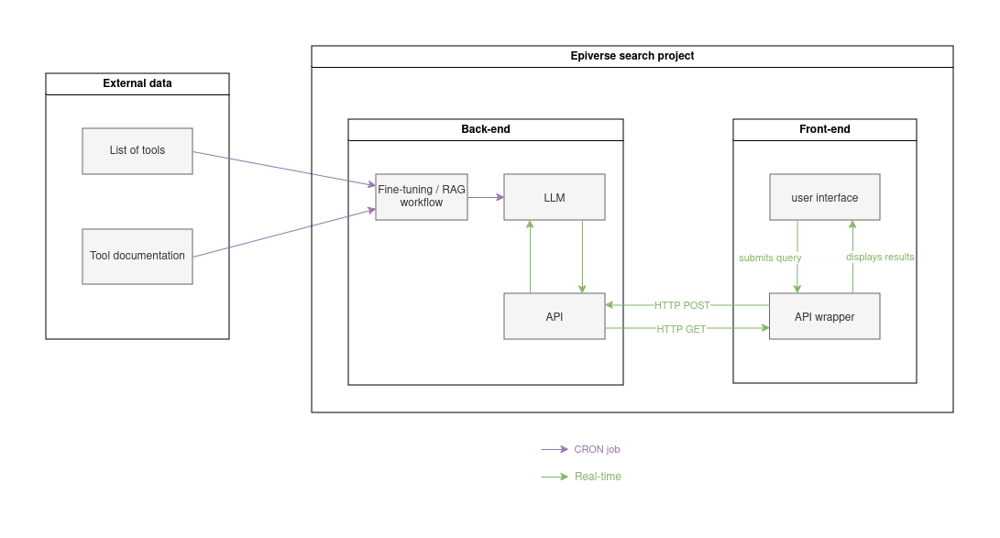

# Epiverse search

## User personas
- Epidemiology tool implementer
- Epidemiology tool creator
- Deployment user

## User stories
This work is mostly targeted at the following persona, with the following stories:

- As an epidemiology tool implementer or epidemiology tool creator I want to find out *if* there is an R package for a specific epidemiological analysis task I have in mind
- As an epidemiology tool implementer I want to be able to select the right tool for the job.
- As an epidemiology tool creator I want to find out the implementation details of existing R package for specific epidemiological analysis task I have in mind to determine how to contribute (create a new one, build on existing on).
- As a deployment user I want to incrementally add/update/delete documents from the search
- As a deployment user I want to adjust control parameters to influence the quality of the search
- As a deployment user I want to view the current set of search queries and how they perform for quality control purposes

These user stories have been collected at:

- the '100 days and 100 lines of code' workshop (December 2022)
- the 'Solution for Collaboratory' launch workshop (January 2023)

## Requirements

The search functionality should:

- take natural language text description of the task the user is trying to perform (e.g., "I want to estimate the risk of a dengue outbreak in Colombia in the next 3 months")
- return a (list of) valid R package(s) performing the described task, taken from the CRAN Task View in Epidemiology
- order result by match to the search query
- provide control parameters to the user to filter the results (e.g., by package name, by package description, by package author)

The search functionality should NOT:

- return hallucinated non-existing R packages
- return stochastic results. The same query on the same version of the engine should return the same results however the order of results may change. (Perhaps this should be defined probabilistically to allow for future improvements e.g. X% of the time the top result will be the same as the previous run, Y% of the time the top 3 results will be the same as the previous run, etc.)
- return irrelevant results. There needs to be a threshold of relevance for a package to be returned (again, can be defined probabilistically).

## Architecture

## Deployment

1. Front-end: This will be part of the https://epiverse-trace.github.io/ website.
As a consequence, the final user interface should be a webapp, embeddable in a simple static website hosted on GitHub Pages.
2. Back-end: The search engine should be deployed on a server, with a REST API to be called by the front-end.
3. Data processing pipelines: The engine also needs to be updated regularly (daily, weekly, monthly) using the new data (new packages and new data about existing packages).

## Out of scope

- The search results are based EXCLUSIVELY on match to the described task. Software quality is not taken into account in result rankings

## Previous and related work

- https://github.com/epiverse-trace/llm-guidance

