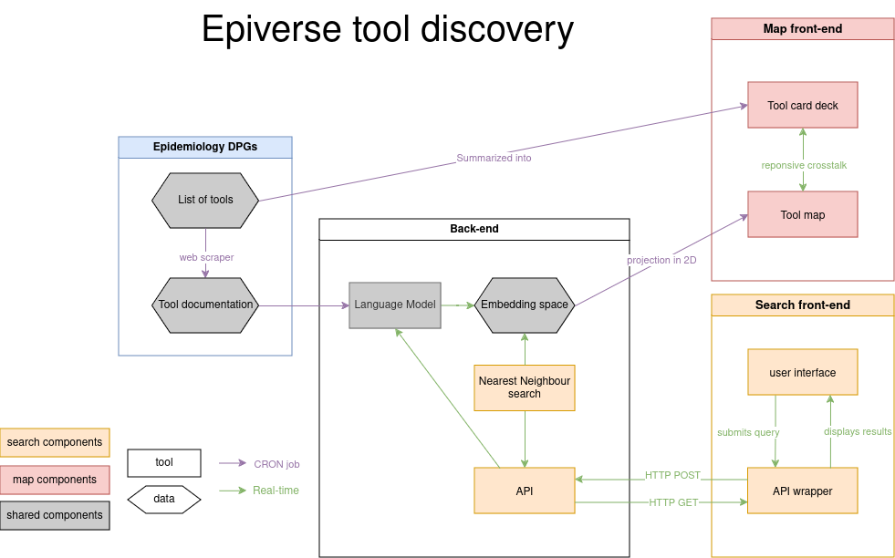

# Epiverse search

## User persona & user story

This work is mostly targeted at the following persona, with the following stories:

- As a Pandemic & Epidemic Intelligence tool implementer, I want to find out if there is an R package to do this specific epidemiological analysis task I have in mind. This allows me to quickly find the right tool for the job.
- As a Pandemic & Epidemic Intelligence tool creator, I want to find out if there is an R package to do this specific epidemiological analysis task I have in mind. This prevents me from reinventing the wheel and increasing the ecosystem fragmentation.

These user stories have been collected at:

- the '100 days and 100 lines of code' workshop (December 2022)
- the 'Solution for Collaboratory' launch workshop (January 2023)

## Requirements

The search functionality should:

- take natural language text description of the task the user is trying to perform (e.g., "I want to estimate the risk of a dengue outbreak in Colombia in the next 3 months")
- return a (list of) valid R package(s) performing the described task, taken from the CRAN Task View in Epidemiology
- order result by match to the search query

The search functionality should NOT:

- return hallucinated non-existing R packages
- return stochastic results. The same query on the same version of the engine should return the same results
- return irrelevant results. There needs to be a threshold of relevance for a package to be returned

## Architecture

## Deployment

This will be part of the https://epiverse-trace.github.io/ website.
As a consequence, the final user interface should be a webapp, embeddable in a simple static website hosted on GitHub Pages.

The engine also needs to be redeployed every week, or at least every month, using the new data (new packages and new data about existing packages).

## Out of scope

- The search results are based EXCLUSIVELY on match to the described task. Software quality is not taken into account in result rankings

## Previous and related work

- https://github.com/epiverse-trace/llm-guidance

